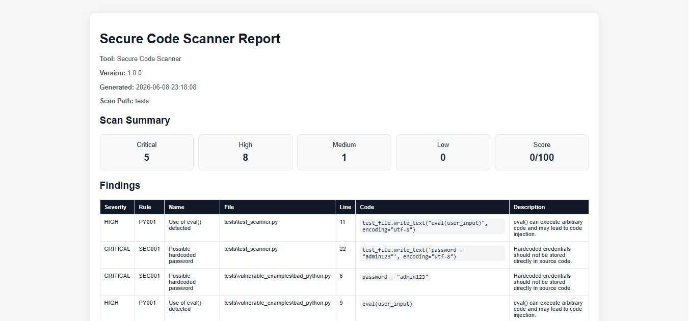
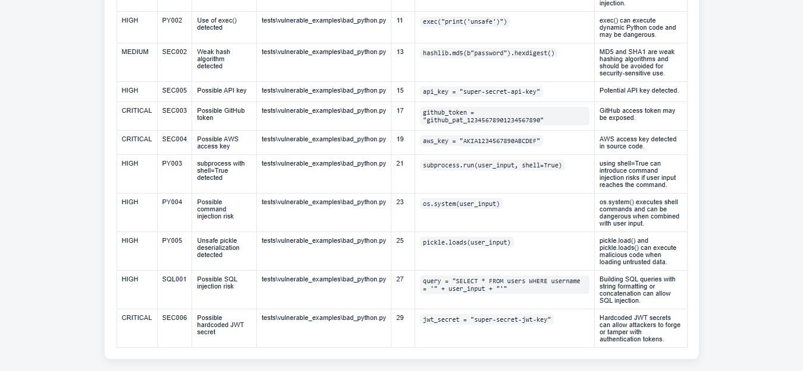
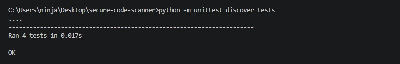
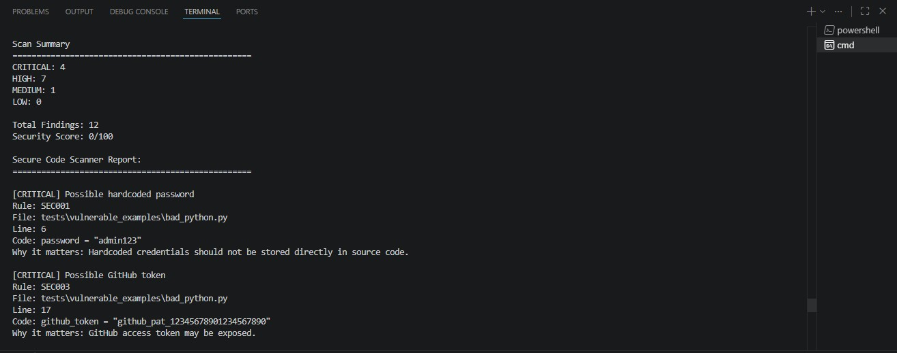

# Secure Code Scanner

A Python-based Static Application Security Testing (SAST) tool that scans source code for insecure coding patterns, exposed secrets, and common security vulnerabilities.

---

## Overview

Secure Code Scanner was developed as a cybersecurity portfolio project to demonstrate secure software development, static analysis, automated testing, vulnerability reporting, and defensive security practices.

The tool recursively scans source code files, identifies security issues, assigns severity ratings, calculates a security score, and generates both JSON and HTML reports.

---

## Screenshots

### HTML Reports




### Terminal Output





## Features

### Static Analysis

The scanner currently detects:

* Hardcoded passwords
* Exposed API keys
* Exposed GitHub tokens
* Exposed AWS access keys
* Use of `eval()`
* Use of `exec()`
* Weak hashing algorithms such as MD5 and SHA1

### Reporting

* Terminal-based vulnerability reports
* JSON report export
* HTML report export
* Security score calculation (0-100)
* Severity summaries
* File locations and line numbers
* Scan timestamps and metadata

### Testing

* Automated unit tests using Python's `unittest`
* Validation of rule detection logic
* Validation of security score calculations

---

## Example Usage

### Scan a Project

```bash
python main.py --path tests
```

### Export JSON Report

```bash
python main.py --path tests --json report.json
```

### Export HTML Report

```bash
python main.py --path tests --html report.html
```

### Export Both JSON and HTML Reports

```bash
python main.py --path tests --json report.json --html report.html
```

---

## Example Output

```text
Scan Summary
==================================================
CRITICAL: 3
HIGH: 3
MEDIUM: 1
LOW: 0

Total Findings: 7
Security Score: 5/100
```

---

## Example Findings

```text
[CRITICAL] Possible hardcoded password
Rule: SEC001
File: tests\vulnerable_examples\bad_python.py
Line: 3

[CRITICAL] Possible GitHub token
Rule: SEC003
File: tests\vulnerable_examples\bad_python.py
Line: 14

[CRITICAL] Possible AWS access key
Rule: SEC004
File: tests\vulnerable_examples\bad_python.py
Line: 16
```

---

## Project Structure

```text
secure-code-scanner/
│
├── scanner/
│   ├── __init__.py
│   ├── engine.py
│   ├── exporter.py
│   ├── reporter.py
│   └── rules.py
│
├── tests/
│   ├── test_scanner.py
│   └── vulnerable_examples/
│       └── bad_python.py
│
├── main.py
├── README.md
└── requirements.txt
```

---

## Technologies Used

* Python
* Regular Expressions (Regex)
* JSON
* HTML
* unittest
* Git
* GitHub

---

## Security Scoring

Each finding contributes risk points based on severity:

| Severity | Points |
| -------- | ------ |
| Critical | 20     |
| High     | 10     |
| Medium   | 5      |
| Low      | 1      |

The security score starts at **100** and decreases based on the findings detected during a scan.

---

## Ethical Use

This tool is intended for defensive security purposes only.

It should only be used on codebases that you own or have explicit permission to assess.

The project was created for secure development education, cybersecurity learning, and portfolio development.

---

## Future Improvements

Planned enhancements include:

* GitHub Actions CI/CD integration
* SARIF report export
* Expanded language support
* Additional secret scanning rules
* File exclusion support
* Additional security scoring metrics
* Detection of insecure cryptographic configurations

---

## Author

**Brandon Powell**

Higher Education Diploma in Information Technology (Full-Stack Web Development)

Future Bachelor of Information Technology (Computer Science & Cybersecurity)

Aspiring Cybersecurity Professional with interests in Secure Software Development, Application Security, and Penetration Testing.
